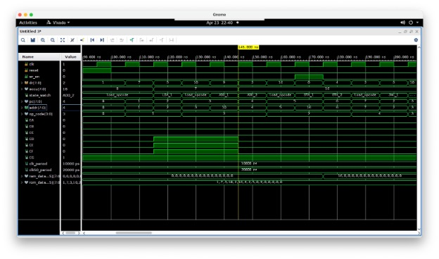
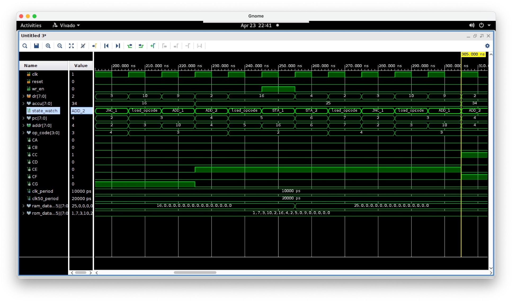
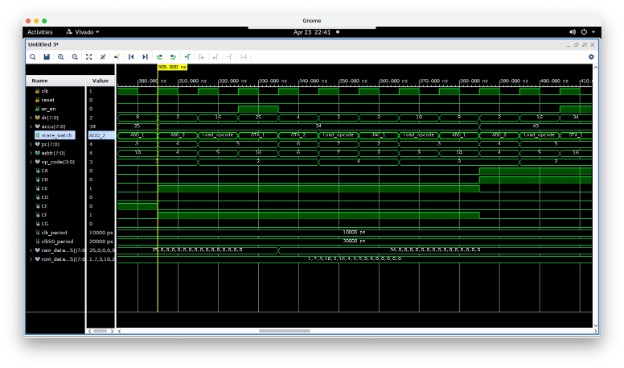
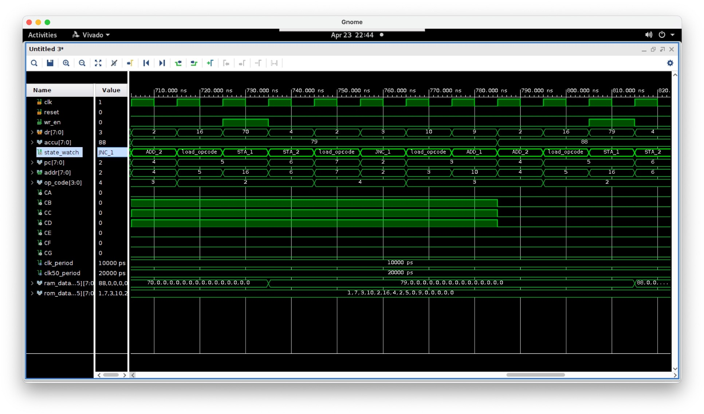
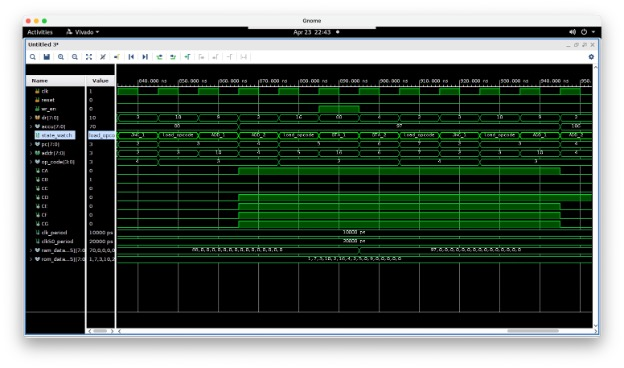
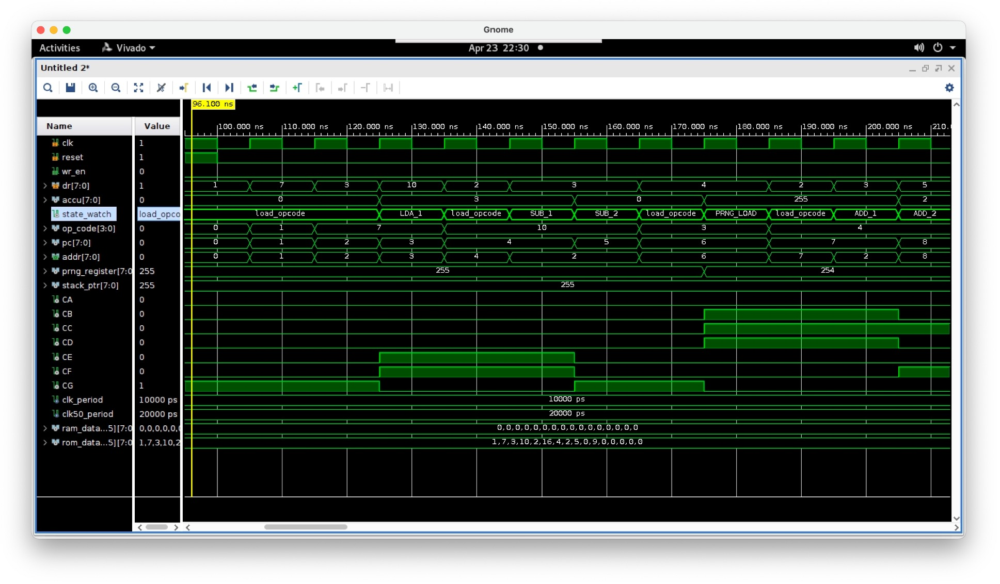
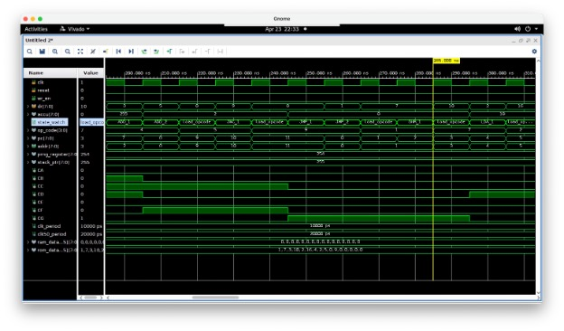
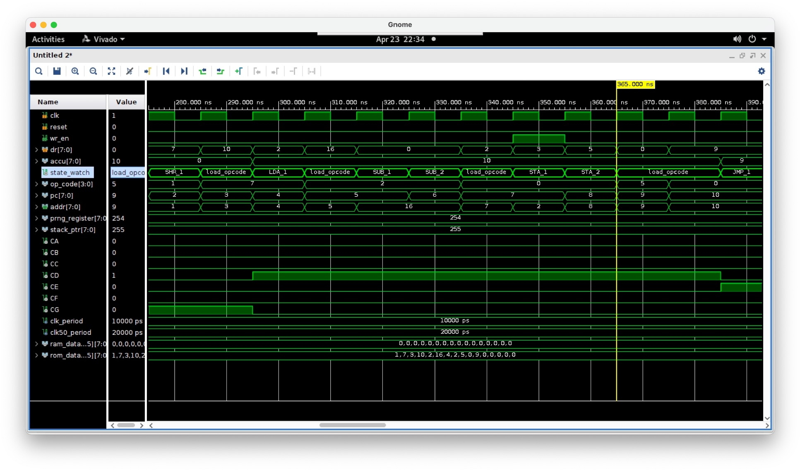
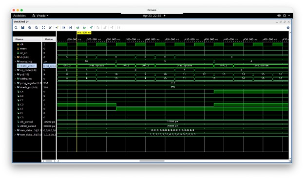

# Microprocessor Design and Simulation in VHDL

## 📌 Project Overview

This project implements a **simple microprocessor** in **VHDL**, supporting a **basic instruction set** with memory access, arithmetic operations, and control flow mechanisms. The project is divided into **two parts**:
- **Part 1**: Implements a **basic CPU** with a minimal instruction set.
- **Part 2**: Extends functionality with additional instructions, subroutines, and optimizations.

The design includes:
✔ **8-bit data and address buses**
✔ **8-bit accumulator and program counter**
✔ **Finite State Machine (FSM) based control unit**
✔ **Memory interface for program execution**

---

# 🚀 Part 1: Base Microprocessor Design

### ✅ Implemented Features
- **8-bit accumulator, program counter, and instruction decoder.**
- **Instruction Set:**
  - `LDA (data)`: Load data into accumulator.
  - `STA (addr)`: Store accumulator value in memory.
  - `ADD (addr)`: Add memory value to accumulator.
  - `JMP (addr)`: Jump to a specified address.
  - `JNC (addr)`: Jump if no carry is set.
- **Memory Interface:**
  - Separate **read (`dr`)** and **write (`dw`)** data buses.
  - **Write Enable (`wr_en`)** for memory writes.
- **Finite State Machine (FSM) for instruction execution.**

### 🔧 Instruction Set (Part 1)

| Mnemonic | Opcode | Operand | Description |
|----------|--------|---------|-------------|
| `LDA`    | `0x01` | Data    | Load immediate value into accumulator. |
| `STA`    | `0x02` | Address | Store accumulator contents at memory address. |
| `ADD`    | `0x03` | Address | Add value from memory to accumulator. |
| `JNC`    | `0x04` | Address | Jump to address if no carry. |
| `JMP`    | `0x05` | Address | Unconditional jump. |

### 🖥️ Example Program
```assembly
LDA 0x07      ; Load 7 into ACC
ADD 0x0A      ; Add value at address 0x0A (9)
STA 0x10      ; Store result in address 0x10
JNC 0x02      ; Jump back to ADD if no carry
JMP 0x00      ; Restart program
```

### 📸 Simulation Output







---

# 🚀 Part 2: Extended Microprocessor Design

### ✅ Additional Features
- **New Instructions:**
  - `SUB (addr)`: Subtract memory value from accumulator.
  - `SHL`: Shift accumulator left.
  - `SHR`: Shift accumulator right.
  - `MUL (addr)`: Multiply accumulator with memory value.
  - `RND`: Load pseudo-random number into accumulator.
  - `JSR (addr)`: Jump to subroutine.
  - `RET`: Return from subroutine.
- **Stack Memory for Subroutines**
- **Enhanced Memory Operations**
- **Overflow and Carry Flag Handling**
- **Expanded FSM with multi-cycle instruction execution**

### 🔧 Instruction Set (Part 2)

| Mnemonic | Opcode | Operand | Description |
|----------|--------|---------|-------------|
| `SUB`    | `0x06` | Address | Subtract value from memory from accumulator. |
| `SHL`    | `0x07` | None    | Shift accumulator left. |
| `SHR`    | `0x08` | None    | Shift accumulator right. |
| `MUL`    | `0x09` | Address | Multiply accumulator by memory value. |
| `RND`    | `0x0A` | None    | Load random number into accumulator. |
| `JSR`    | `0x0B` | Address | Jump to subroutine. |
| `RET`    | `0x0C` | None    | Return from subroutine. |

### 🖥️ Example Program
```assembly
LDA 0x05      ; Load 5 into ACC
MUL 0x04      ; Multiply with value at address 0x04
STA 0x10      ; Store result in address 0x10
JSR 0x20      ; Call subroutine at 0x20
RET           ; Return to main program
```

### 📸 Simulation Output





---